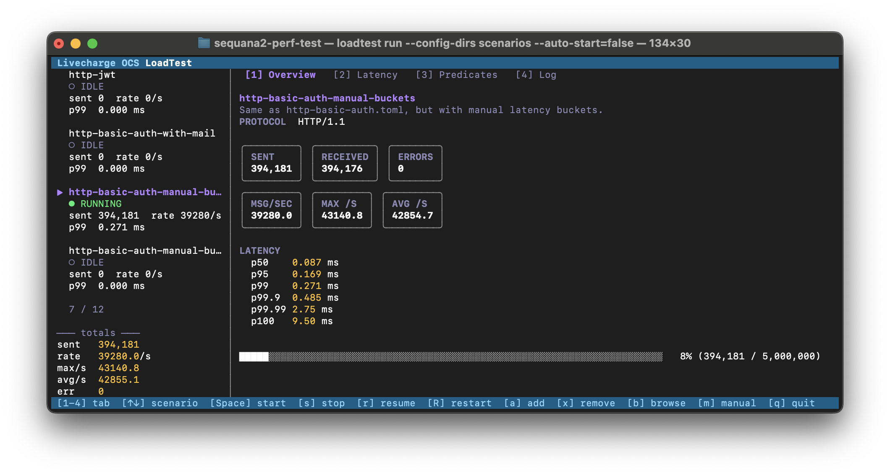

# Livecharge OCS LoadTest

**`loadtest`** is a standalone Go CLI **load-testing tool with a live TUI dashboard**, built for **HTTP / HTTPS / HTTP/2 and NATS** stress testing. It drives multi-step sessions from TOML scenarios, measures sub-millisecond latency with HDR histograms, ships a built-in mock server, and runs equally well headless in CI.



---

## Channel Systems

This tool is used by Channel Technologies for testing their Livecharge product range, an OCS (Online Charging System) and Billing Suite.

**Channel Systems** is a software vendor located in The Netherlands, specialized in carrier-grade software for MNO, MVNE, MVNO and IoT service providers.
Check out https://channel.tech/ for more information about their product portfolio, such as **LiveCharge** (Rating, Billing and Charging), **LiveCore** (CRM and BSS) and **LiveCom** (Voice AI applications)

---

## Main features

- **Live TUI dashboard** to dynamically interact with your testcases — start, stop, resume, restart, add and remove scenarios on the fly.
- **Multi-protocol transport** — NATS and HTTP/HTTPS with `none`, `userpass`, HTTP Basic, and JWT Bearer auth.
- **HTTP/2 client and server** — drive endpoints over h2c (`h2c://`) or h2 via ALPN (`https://`), with full server tunables on the mock side (max concurrent streams, window sizes, frame size).
- **Multi-step sessions** with JSON / header / status-code extraction and predicate-driven conditional flow.
- **Expression predicates** via `op = "expr"` — write boolean expressions over the response body, session vars, and scenario context using [expr-lang/expr](https://github.com/expr-lang/expr).
- **Sub-millisecond latency measurement** using HDR histograms with configurable buckets (auto or fully manual edges).
- **High performance** — thousands of messages per second per scenario.
- **Realtime throughput stats** — current, peak, and lifetime-average msg/sec.
- **CSV export** with float-ms latency columns, predicate counts, and `{timestamp}` placeholders.
- **Suite runs** — execute multiple scenarios concurrently from a single suite file.
- **Built-in mock server** (NATS + HTTP / HTTPS / HTTP/2) with configurable `fail_rate`, `no_answer_rate`, chunked streaming, and auto-generated self-signed TLS certs.
- **Email notifications** on any combination of lifecycle events — `start`, `progress` (at a configurable cadence), `done`, and `error` — sent over SMTP (STARTTLS + auth) with text, HTML, or `multipart/alternative` body, log attachments, and templated subject/body.
- **Headless / CI mode** with structured logs and proper exit codes.
- **Embedded operational manual** — view it from inside the TUI (`m`) or via `loadtest manual`.

---

## Quick start

Requires Go 1.22 or later. No external services needed — the bundled mock server acts as the target.

```bash
git clone https://github.com/wimheynderickx/livecharge-loadtest.git loadtest
cd loadtest
make build
```

Run a self-contained HTTP/2 (h2c) stress test in two terminals:

```bash
# Terminal 1 — start the mock target
./bin/loadtest mock --config mock/h2c-mock.toml

# Terminal 2 — drive load against it
./bin/loadtest run --config scenarios/h2c-example.toml
```

The TUI opens, fires 200 requests at 50 req/s over HTTP/2 cleartext, and shows live counters, latency percentiles, and a histogram. Press `q` to quit, `m` for the in-TUI manual.

For a headless CI run, add `--no-tui`:

```bash
./bin/loadtest run --config scenarios/h2c-example.toml --no-tui
```

Other ready-to-run pairings in [`scenarios/`](scenarios/) + [`mock/`](mock/):

| Scenario | Mock | What it shows |
|---|---|---|
| `nats-single-step-example.toml` | `nats-mock.toml` | Plain NATS request/reply (needs `nats-server`). |
| `http-multistep-example.toml` | `http-mock.toml` | Three-step HTTP session with field extraction. |
| `h2-tls-example.toml` | `h2-mock.toml` | HTTP/2 over TLS via ALPN, self-signed cert. |
| `expr-predicates-example.toml` | `http-mock-noerrors.toml` | Branching flow driven by `op = "expr"` predicates. |
| `suite-example.toml` | (multiple) | Suite running several scenarios concurrently. |

---

## Documentation

- **[Operational manual](internal/manual/manual.md)** — full reference for scenarios, suites, mock configs, predicates, email notifications, the TUI, CSV output, Docker, and recipes. Also reachable from the binary itself: `loadtest manual` or press `m` in the TUI.
- **[Repository layout](internal/manual/repository-layout.md)** — what every directory and file is for, intended for contributors and Go newcomers.

---

## License

See [LICENSE](LICENSE).
